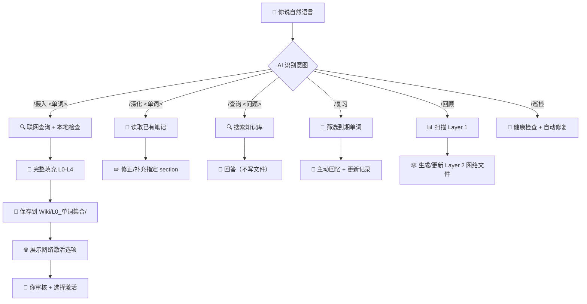

# 交互指令

> [!abstract] 设计哲学
> 本指令体系借鉴 **Andrej Karpathy 的 LLM Wiki** 构建哲学，结合**神经网络隐喻**：
> - **AI 负责写入和维护**，人类负责阅读、审核和深化
> - 知识库是**持久的、复利的产物**——每次摄入都在累积
> - **网络激活**：每个单词笔记完整填充，但按需选择该单词参与哪些 Layer 2 网络文件的生成
> - **两层架构**：Layer 1（单词层）→ Layer 2（网络层），从单词笔记反向生成网络文件
> - 通过**巡检+级联更新+自进化**保持知识库健康
>
> 详细实现规则见 [[指令实现]]。

---

## 交互流程总览

> [!info] 你和 AI 的交互方式
> 你只需要说自然语言，AI 自动识别你的意图并执行对应操作。



> [!tip] 最常用的操作
> - **日常学习**：`/摄入 <单词>` → 审核 → 补充记忆锚点
> - **积累后整理**：每 10-20 个单词后 `/回顾` → 生成网络文件 → 人工精修
> - **定期维护**：`/巡检` → 查看报告 → 处理问题

---

## Rule 1：摄入

> 将一个新单词"编译"进知识库（Layer 1）。

**你说**：
```
/摄入 ambiguity
学习单词 ambiguity
摄入 ambiguity, vague, obscure
```

**AI 自动完成**：
- 联网查询：音标、词频、考研释义、词根词缀、搭配、真题例句
- 判定语义场（10分类之一）
- 按 [[Wiki/_模板-单词笔记|模板]] **完整填充 L0-L4 所有 section**：
  - L0：基础信息、核心释义、原型义、词根词缀
  - L1：词义链路+激活条件、词性转换、记忆锚点
  - L2：同义词辨析+"增"标记、反义词、派生词链接
  - L3：搭配与短语、真题/语料关联
  - L4：主动产出（留空，等你实际使用后填写）

**保存**到 `Wiki/L0_单词集合/<单词>.md`

**🌐 网络激活选项**（保存后展示）：
AI 列出该单词可以贡献到的 Layer 2 网络文件，你选择需要激活的：
```
🌐 <单词> 的网络激活选项：
  [1] 词根 ambi-（两者/周围）→ 参与生成词根笔记 [[ambi]]
  [2] 同义群 vague/obscure/implicit → 参与生成辨析笔记 [[模糊的]]
  [3] 形近词 ambiguity/ambidextrous → 参与生成形近词笔记

回复编号激活（如 "123" 或 "全选" 或 "跳过"）：
```
- 你选择的网络 → `/回顾` 时该单词的数据会参与对应网络文件的生成
- 你跳过的网络 → 暂不参与，之后可随时通过 `/深化` 补充

**你需要做**：
- 审核生成的内容，修正不准确的部分
- 选择需要激活的网络连接（决定该单词参与哪些 Layer 2 网络文件）
- 补充你自己的记忆锚点

---

## Rule 2：深化

> 对已有笔记进行补充、修正或升级。

**你说**：
```
/深化 ambiguity
深化 ambiguity：补充真题例句
ambiguity 的词义链路我觉得不对，应该是...
```

**AI 自动完成**：
- 读取已有笔记
- 根据你的反馈修正指定 section
- 联网补充缺失的内容
- 更新 mastery 等级 + 复习记录

---

## Rule 3：查询

> 基于知识库内容回答问题。

**你说**：
```
/查询 absorb 的同义词
ambiguity 和 vague 有什么区别？
gest 词根有哪些派生词？
```

**AI 自动完成**：
- 读取相关笔记，基于知识库内容回答
- 不修改任何文件

---

## Rule 4：复习

> 间隔复习，主动回忆。

**你说**：
```
/复习
/复习 L0
```

**AI 自动完成**：
- 筛选到期待复习的单词
- 逐词展示原型义，让你主动回忆
- 更新复习记录

| 等级跃迁 | 间隔 | 回忆内容 |
|---------|------|---------|
| L0→L1 | 当天 + 1天后 | 原型义 |
| L1→L2 | 3天后 + 1周后 | 词义链路 + 词根 |
| L2→L3 | 2周后 + 1个月后 | 辨析 + 语料 |
| L3→L4 | 2个月后 | 写作/翻译主动产出 |

---

## Rule 5：回顾 + 生成网络

> 摄入一定量单词后，从 Layer 1（单词层）反向提取，生成 Layer 2（网络层）文件。

**你说**：
```
/回顾
/回顾 词根
/回顾 同义辨析
```

**AI 自动完成**：
1. **扫描** Layer 1 所有单词笔记，提取共享的词根/同义群/形近词
2. **生成** Layer 2 网络文件：
   - `Wiki/词根词缀/ambi.md` ← 从所有含 ambi- 的单词笔记中提取词根信息
   - `Wiki/同义辨析/模糊的.md` ← 从 ambiguity/vague/obscure 的同义词 section 中提取
   - `Wiki/形近词/xxx.md` ← 从形近词 section 中提取
3. **填充**内容来自各单词笔记的对应段落，自动汇总去重
4. **建立双向链接**：网络文件 ↔ 单词笔记

**你需要做**：
- 审核生成的网络文件，人工精修（这才是真正的"深化"）
- 补充 AI 无法生成的内容（如辨析口诀、故事会）

> [!tip] 什么时候执行？
> 建议每摄入 **10-20 个单词**后执行一次 `/回顾`，让网络层持续生长。

---

## Rule 6：巡检 + 维护

> 知识库健康检查 + 自动维护。

**你说**：
```
/巡检
```

**AI 自动完成**：

**自动修复**：
- 🔗 链接完整性：修复断链
- 📋 Frontmatter 完整性：补全缺失字段
- 🔄 级联更新：Layer 1 单词修改后，同步更新 Layer 2 网络文件

**报告（需人工处理）**：
- ⏰ 复习过期：超过间隔 2 倍未复习的单词
- 🏝️ 孤立笔记：无 inbound links 的单词
- 📦 L0 堆积：创建超过 7 天仍为 L0 的单词
- 🗑️ 重复内容：语义高度重叠的笔记，建议合并
- 📈 知识库统计：总词数、各语义场分布、mastery 分布

---

## 快速参考

| 指令 | 作用 | 写文件？ | 层级 |
|------|------|---------|------|
| `/摄入 <单词>` | 编译新单词（Layer 1） | ✅ | 单词层 |
| `/深化 <单词>` | 补充/修正已有笔记 | ✅ | 单词层 |
| `/查询 <问题>` | 基于知识库回答 | ❌ | — |
| `/复习 [等级]` | 间隔复习 + 主动回忆 | ✅ | 单词层 |
| `/回顾 [类型]` | 反向生成网络文件（Layer 2） | ✅ | 网络层 |
| `/巡检` | 健康检查 + 自动维护 | ✅ | 全局 |

### 两层架构

```
Layer 1（单词层）          Layer 2（网络层）
L0_单词集合/               词根词缀/
  ambiguity.md    ──→       ambi.md
  ambiguous.md    ──→       同义辨析/
  ambition.md     ──→         模糊的.md
  ambient.md      ──→       形近词/
                           形近串.md

/摄入 → 填充 Layer 1
/回顾 → 从 Layer 1 提取 → 生成 Layer 2
/深化 → 人工精修 Layer 2
/巡检 → 检查两层一致性
```
